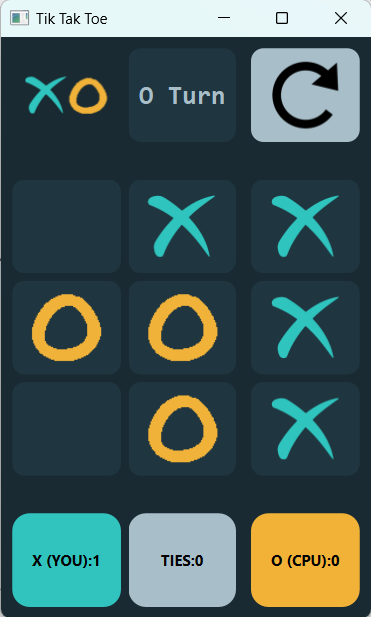
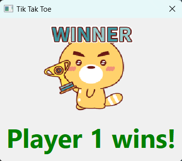
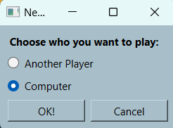

# 18th Assignments in Python

# Tik Tak Toe Game

This is a simple implementation of the Tic Tac Toe game using Python and PySide6 (a Python binding for Qt). The game allows two players to play against each other, with one player being the user and the other being the CPU. The user can also choose to play against another human player.


---

## Features:
- Two game modes: Player vs Player and Player vs CPU.
- Animated GIFs for win and tie outcomes.
- Keeps track of wins and ties for both players.
- Reset option to start a new game.

---

## How to Play:

1. Choose the game mode by clicking on "New Game" button and selecting either "Player vs Player" or "Player vs CPU".
2. In the game window, players take turns clicking on empty cells to place their symbol (X or O).
3. The game ends when one player achieves a winning combination (three X's or O's in a row, column, or diagonal), or when all cells are filled resulting in a tie.
4. Wins and ties are displayed on the interface for both players.

        

---
## Controls

- Click on a cell to place your symbol (X or O).
- Click on "New Game" to start a new game.
- Click on "Reset" to reset the game and scores.



---

## Requirements

- Python 3.x
- PySide6

Install PySide6 using pip:
```
pip install PySide6
```
---
## How to Run

```
1. Make sure you have Python and PySide6 installed.
2. Run the Python script tik_tak_toe.py
```

